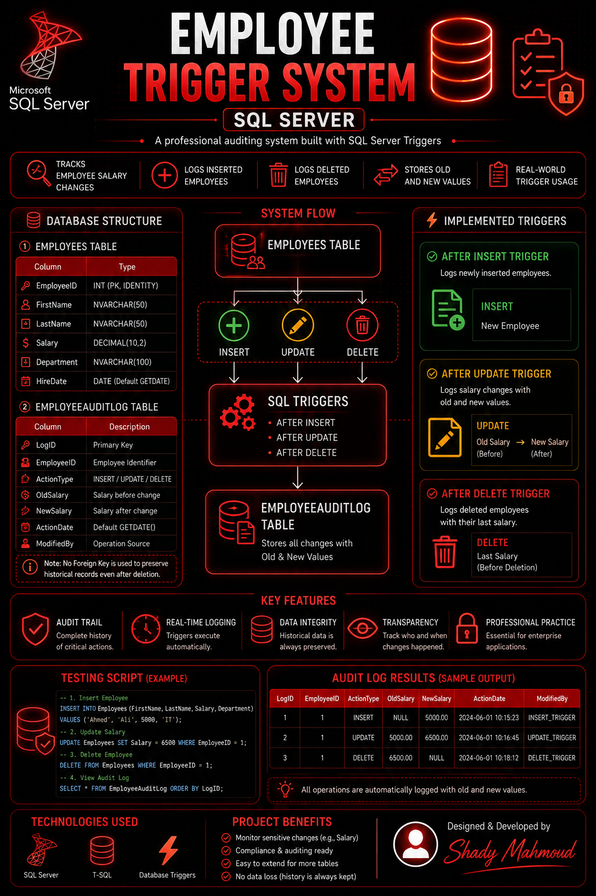

<p align="center">
  
</p>


# 👨‍💼 Employee Trigger System (SQL Server)

A professional SQL Server project that demonstrates how to implement
database-level auditing using Triggers.

This system automatically logs all INSERT, UPDATE, and DELETE
operations performed on the Employees table.

---

## 🎯 Project Goal

Build a clean and structured auditing system that:

- Tracks employee salary changes
- Logs inserted employees
- Logs deleted employees
- Stores old and new values
- Demonstrates real-world Trigger usage

---

## 🏗 Database Structure

### 1️⃣ Employees Table

| Column       | Type            |
|--------------|-----------------|
| EmployeeID   | INT (PK, IDENTITY) |
| FirstName    | NVARCHAR(50) |
| LastName     | NVARCHAR(50) |
| Salary       | DECIMAL(10,2) |
| Department   | NVARCHAR(100) |
| HireDate     | DATE (Default GETDATE) |

---

### 2️⃣ EmployeeAuditLog Table

| Column       | Description |
|--------------|------------|
| LogID        | Primary Key |
| EmployeeID   | Employee Identifier |
| ActionType   | INSERT / UPDATE / DELETE |
| OldSalary    | Salary before change |
| NewSalary    | Salary after change |
| ActionDate   | Default GETDATE() |
| ModifiedBy   | Operation Source |

> Note: No Foreign Key is used to preserve historical records even after deletion.

---

## ⚙️ Implemented Triggers

### ✅ AFTER INSERT
Logs newly inserted employees.

### ✅ AFTER UPDATE
Logs salary changes with old and new values.

### ✅ AFTER DELETE
Logs deleted employees with their last salary.

---

## 🧪 Testing

The project includes a testing script:

- Insert employee
- Update salary
- Delete employee
- View Audit Log

```sql
SELECT * FROM EmployeeAuditLog;
